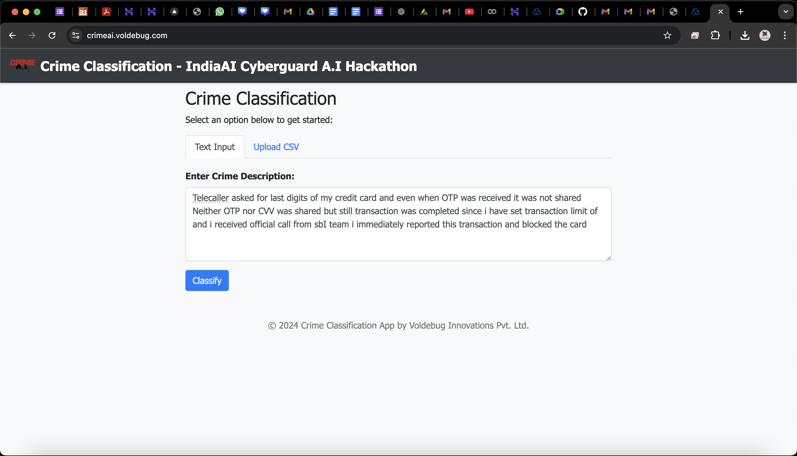

# **Crime Classification Web Application**

This repository contains the source code for a web-based crime classification application developed by **Voldebug Innovations Pvt. Ltd.** The application leverages machine learning to classify crime descriptions into predefined categories and subcategories.

 <!-- Optional: Add a screenshot of your application -->

## **Features**

- **Text Input Classification**: Enter a crime description to receive instant classification.
- **Batch Processing via CSV Upload**: Upload a CSV file with crime descriptions to get bulk classifications.
- **Modern and Responsive UI**: Built with Flask and Bootstrap for a clean and user-friendly interface.
- **Real-time Processing ETA**: Displays an estimated time of completion for file processing.
- **Downloadable Results**: Easily download the processed CSV file with classification results.

## **Table of Contents**

- [Demo](#demo)
- [Installation](#installation)
- [Usage](#usage)
  - [Text Input Classification](#text-input-classification)
  - [CSV File Upload](#csv-file-upload)
- [Project Structure](#project-structure)
- [Contributing](#contributing)
- [License](#license)
- [Contact](#contact)

## **Demo**

You can access a live demo of the application [here](crimeai.voldebug.com). <!-- Replace with actual link if available -->

## **Installation**

### **Prerequisites**

- Python 3.7 or higher
- pip (Python package installer)

### **Clone the Repository**

```bash
git clone https://github.com/devicelover/indiaai.git
cd your-repository
```

### **Install Dependencies**

```bash
pip install -r requirements.txt
```

### **Download NLTK Data**

```python
import nltk
nltk.download('punkt')
nltk.download('wordnet')
nltk.download('stopwords')
```

### **Model and Encoders**

Place the trained model and encoder files in the `models/` directory:

- `models/crime_classification_model.joblib`
- `models/category_encoder.joblib`
- `models/sub_category_encoder.joblib`

## **Usage**

### **Run the Application**

```bash
python app.py
```

Access the application at `http://localhost:5000`.

### **Text Input Classification**

1. Navigate to the **Text Input** tab.
2. Enter the crime description in the text area.
3. Click **Classify** to get the predicted category and sub-category.

### **CSV File Upload**

1. Navigate to the **Upload CSV** tab.
2. Upload a CSV file containing a `crimeaditionalinfo` column.
3. Click **Process File**.
4. Wait for the processing to complete (ETA displayed).
5. Download the processed CSV file with the classification results.

## **Project Structure**

```
crime_classification_app/
├── app.py
├── requirements.txt
├── models/
│   ├── crime_classification_model.joblib
│   ├── category_encoder.joblib
│   └── sub_category_encoder.joblib
├── templates/
│   ├── layout.html
│   ├── index.html
│   └── result.html
├── static/
│   ├── style.css
│   └── app_screenshot.png
```

- **`app.py`**: Main Flask application file.
- **`requirements.txt`**: Python dependencies.
- **`models/`**: Contains the trained model and encoders.
- **`templates/`**: HTML templates for the web pages.
- **`static/`**: Static assets like CSS and images.

## **Contributing**

Contributions are welcome! Please follow these steps:

1. Fork the repository.
2. Create a new branch: `git checkout -b feature/your-feature-name`.
3. Commit your changes: `git commit -am 'Add some feature'`.
4. Push to the branch: `git push origin feature/your-feature-name`.
5. Open a pull request.

## **License**

This project is licensed.

---

**© 2024 Voldebug Innovations Pvt. Ltd. All rights reserved.**

---

## **Contact**

For any inquiries or support, please contact:

- **Email**: contactus@voldebug.in
- **Website**: [www.voldebug.in](https://www.voldebug.in)
